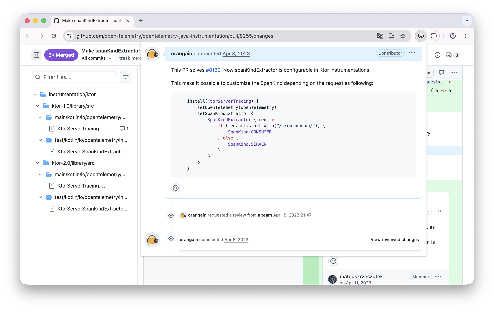

# GitHub Conversation Button

A minimal Chrome extension that adds a single toolbar button. Click it on any Pull Request page to see the PR's Conversation tab in a popup.

## Features

- One toolbar button. Click it on a PR page to open the Conversation tab in a popup.

## How this differs from GitHub's built-in feature

GitHub's own "Files changed" view [now shows the PR description inline](https://github.blog/changelog/2025-11-20-pull-request-files-changed-public-preview-november-20-updates/). Two differences:

- **The full conversation, not just the description.** This extension shows the entire timeline — comments, review threads, and events — not only the opening description.
- **In a popup, without taking over the current page.** The conversation appears in a separate popup, so your scroll position, focus, and the diff view on the page are untouched.

## Installation

1. Clone or download this repository
2. Open Chrome and navigate to `chrome://extensions/`
3. Enable "Developer mode" in the top right
4. Click "Load unpacked" and select the extension directory

## Usage

1. Open any Pull Request page on GitHub
2. Click the extension icon in the Chrome toolbar
3. The Conversation timeline appears inside the popup

## License

MIT License
